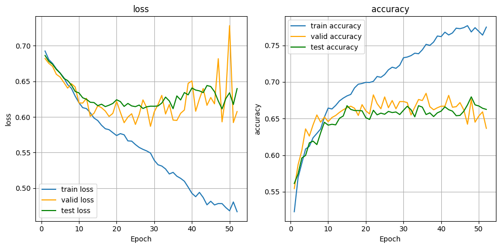
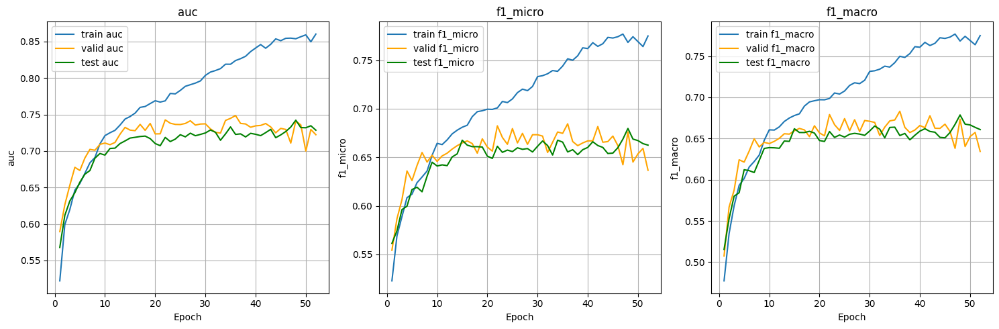

# RUN
```
python train.py --dataset PolitiFact
```
# TEST
the trained model is saved in the checkpoint directory
```
python test_trained_model.py
```
# RESULTS
average metrics on the five folds of Politifact




